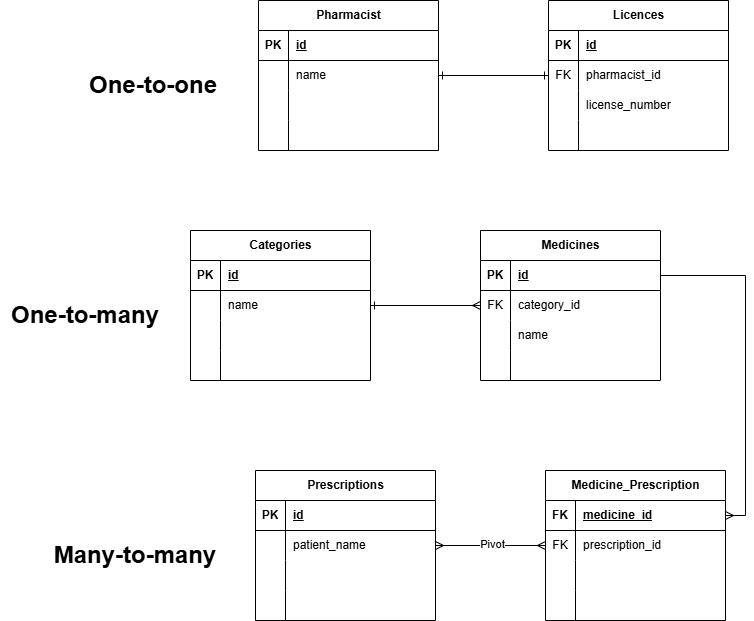

# Pharmacy Management System - Eloquent Relationships Assignment

This Laravel project demonstrates the implementation of the three primary Eloquent relationships: **One-to-One**, **One-to-Many**, and **Many-to-Many**. 

## 1. Entity Relationship Diagram (ERD)

Below is the database schema designed in Draw.io, illustrating how the entities are connected.



---

## 2. Relationships Implemented

### **One-to-One (1:1)**
* **Entities:** `Pharmacist` <-> `Licence`
* **Logic:** Each pharmacist is assigned exactly one professional license.
* **Location:** * Model: `app/Models/Pharmacist.php` (`licence()` method)
    * Migration: `database/migrations/2026_03_30_162927_create_licences_table.php` (contains `pharmacist_id`)

### **One-to-Many (1:N)**
* **Entities:** `Category` <-> `Medicine`
* **Logic:** A medical category (e.g., Antibiotics) can contain multiple different medicines.
* **Location:** * Model: `app/Models/Category.php` (`medicines()` method)
    * Migration: `database/migrations/2026_03_30_162942_create_medicines_table.php` (contains `category_id`)

### **Many-to-Many (N:M)**
* **Entities:** `Medicine` <-> `Prescription`
* **Logic:** A single prescription can include multiple medicines, and a specific medicine can be featured in many different prescriptions.
* **Location:** * Models: `app/Models/Medicine.php` and `app/Models/Prescription.php` (`belongsToMany`)
    * Pivot Table: `database/migrations/2026_03_30_162956_create_medicine_prescription_table.php`

---

## 3. Project Structure Checklist

* **Migrations:** Found in `database/migrations/`. All foreign keys use `constrained()` and `onDelete('cascade')` for data integrity.
* **Models:** Found in `app/Models/`. All relationship methods are defined using Eloquent's native methods.
* **Naming Conventions:** Tables follow plural naming (e.g., `medicines`), while Models follow singular naming (e.g., `Medicine`).

---

## 4. How to Run (For Testing)

#### 🚀 1. Clone the Repository

``` bash
git clone https://github.com/m31-3m/wad-act2.git
cd wad-act2
```

#### 📥 2. Install Dependencies

Make sure you have Composer installed, then run:

``` bash
composer install
```

#### ⚙️ 3. Environment Setup

Copy the example environment file:

``` bash
cp .env.example .env
```

Generate the application key:

``` bash
php artisan key:generate
```

#### 🗄️ 4. Run Migrations

This project uses **SQLite**. Run the migration to generate the tables and foreign keys:

``` bash
php artisan migrate
```

> **Note:** Type `yes` if prompted to create the `database.sqlite` file.


#### 🧱 5. Verification (Optional)

To see the relationships in action, you can use Laravel Tinker:

``` bash
php artisan tinker
```

Example:

``` php
App\\Models\\Pharmacist::all();
```
